# unified-agent

One interactive terminal UX above Claude, Codex, and Gemini.

<p align="center">
  
</p>

## What This Is (MVP)

- A Bun-based REPL
- Provider switching (`:provider`)
- Meta-sessions stored in both JSONL and SQLite
- Optional memory integration via claude-mem (context injection + search)
- Hybrid execution: API-first is pluggable, delegated CLI mode is implemented
- Live delegated execution feedback (concise streamed status/tool-call lines)
- Detailed live telemetry for tools/MCP/command execution/file hints
- Remote brain mode via `--brain-url` with adapter-specific behavior

## Delegated Agent Execution Mode

Delegated provider calls are hard-set to YOLO/unsafe mode:

- Claude: `--dangerously-skip-permissions`
- Codex: `--dangerously-bypass-approvals-and-sandbox`
- Gemini: `--yolo`

Gemini reliability defaults to preview-first model fallback:

- order: `gemini-3-flash-preview` -> `gemini-2.5-flash` -> `gemini-2.5-pro` -> `auto`
- override with: `UNIFIED_AGENT_GEMINI_MODELS=gemini-3-flash-preview,gemini-2.5-flash,gemini-2.5-pro,auto`

## Remote Brain Mode

Remote mode lets one control surface drive provider-specific bodies:

- CLI flags:
  - `--brain-url ws(s)://...`
  - `--brain-provider claude|codex|gemini|mock`
  - `--brain-session-id <id>`
- REPL commands:
  - `:brain connect <ws(s)://url> [provider] [sessionId]`
  - `:brain disconnect`
  - `:brain status`
  - `:brain replay <metaSessionId>`

Important behavior:

- Claude adapter supports native `--sdk-url` forwarding.
- Claude adapter now runs native sdk-url relay semantics (stream-json control frames over stdin, event/result capture over websocket relay) for stable one-shot completion.
- Optional local delegated fallback can be enabled with `UNIFIED_AGENT_CLAUDE_SDK_FALLBACK_LOCAL=1`.
- Native Claude sdk-url timeout defaults to `UNIFIED_AGENT_CLAUDE_SDK_TIMEOUT_MS=45000`.
- Codex and Gemini adapters run compatibility mode (local delegated CLI + canonical control mapping).
- By default `ws://` is denied; use `wss://` or `UNIFIED_AGENT_ALLOW_INSECURE_BRAIN=1`.
- Optional URL allowlist: `UNIFIED_AGENT_BRAIN_URL_ALLOWLIST=<regex1>,<regex2>`.

### Adapter Capability Matrix

| Provider | Native `--sdk-url` | Control subtype parity | Notes |
|---|---|---|---|
| Claude | Yes | Highest | Forwards `--sdk-url` directly to Claude CLI |
| Codex | No | Compatibility subset | Emulates remote body semantics over local CLI |
| Gemini | No | Compatibility subset | Emulates remote body semantics with fallback model logic |
| Mock | N/A | Test-focused | Local deterministic test path |

## Requirements

- Bun installed
- `claude`, `codex`, and `gemini` CLIs available on PATH (delegated mode)
- Optional: `claude-mem` worker running on `http://127.0.0.1:37777`

## Run

```bash
cd 00-09_System/01_Tools/pai-unified-terminal
bun install
bun run start
```

Launch with an initial prompt (stays interactive):

```bash
bun run start -- "Summarize this repo architecture"
```

One-shot prompt (run once and exit):

```bash
bun run start -- --once --provider codex "Output exactly: OK"
```

One-shot with explicit provider model:

```bash
bun run start -- --once --provider codex --model gpt-5 "Summarize this file"
```

One-shot with explicit context controls from turn one:

```bash
bun run start -- --once --provider claude --mem off --context-mode recent --context-turns 10 "Summarize this file"
```

One-shot with remote brain mode:

```bash
bun run start -- --once --brain-url wss://brain.example/ws --brain-provider claude \"Summarize this repo\"
```

Global shell launcher (if `unified` is configured in `~/.zshrc`):

```bash
unified "Draft a migration plan"
unified --once --provider claude "Output exactly: PING"
```

## Smoke Test

Fast local-only smoke:

```bash
bun run smoke
```

Optional provider CLI smoke (may call external services):

```bash
UNIFIED_AGENT_SMOKE_PROVIDERS=1 bun run smoke
```

Gateway-only smoke:

```bash
bun run smoke:gateway
```

Provider adapter smokes:

```bash
bun run smoke:adapter:claude
bun run smoke:adapter:codex
bun run smoke:adapter:gemini
```

## Commands

- `:help`
- `:provider claude|codex|gemini|mock`
- `:model <name|auto|default|off>` (`auto/default/off` clears override and uses provider default)
- `:brain connect <ws(s)://url> [provider] [sessionId]`
- `:brain disconnect`
- `:brain status`
- `:brain replay <metaSessionId>`
- `:session new [projectName]`
- `:session list`
- `:session resume <metaSessionId>`
- `:context show`
- `:context mode off|recent|full`
- `:context turns <n>`
- `:context chars <n>`
- `:context mem on|off`
- `:mem inject` (shows context that would be injected)
- `:mem search <query>`
- `:mem stats`
- `:mem note <text>`
- `:distill scan` (discover sessions across Claude, Codex, Gemini)
- `:distill run [sessionId...] [--providers p1,p2]` (full distillation pipeline)
- `:distill seed claude|codex|gemini [sessionId]` (generate platform-native session file)
- `:distill ask "question" [--platform claude|codex|gemini] [--providers p1,p2]` (question-driven distillation)
- `:distill query <text>` (search chunk FTS index)
- `:distill report [sessionId]` (session statistics)
- `:distill assess [chunkId]` (trigger multi-agent assessment on a chunk)
- `:distill status` (pipeline state: sync queue, assessments, last run)
- `:distill watch on|off` (toggle background file watcher)
- `:quit`

## Conversation Distillation

The distillation pipeline ingests session files from Claude Code, Codex CLI, and Gemini CLI, scores events by importance, chunks them for multi-agent assessment, and generates platform-native session files for seeding new conversations.

### Pipeline

1. **Scan** — discovers session files across platform-specific directories
2. **Parse** — reads each format (Claude JSONL, Codex JSONL, Gemini JSON) into normalized `ParsedEvent` objects
3. **Score** — assigns 0-100 importance scores based on event characteristics
4. **Chunk** — groups scored events into assessment-ready windows with overlap
5. **Assess** — runs multi-agent assessment: each provider CLI rates chunks independently
6. **Consensus** — computes weighted average with outlier rejection
7. **Distill** — selects highest-value chunks within token budget (hybrid sort: 0.7 consensus + 0.3 recency)
8. **Generate** — emits platform-native output (Claude JSONL, Codex JSONL, Gemini JSON)

### Real-Time Scoring

When `UNIFIED_AGENT_DISTILL_ENABLED=1`, every event recorded through the REPL is scored inline before persistence. This adds <1ms latency per event.

### Defensive Memory

The `DefensiveClaudeMemClient` wraps the ClaudeMem HTTP worker with write-local-first semantics. Observations are stored in a local SQLite `_sync_queue` table and synced to ClaudeMem when available. Queue flush runs every 60 seconds.

### Background Watcher

When enabled via `:distill watch on`, polls session directories every 5 seconds for new files and triggers scoring automatically.

### Distillation Smoke Test

```bash
bun run smoke:distill
```

### Environment Variables

| Variable | Default | Purpose |
|---|---|---|
| `UNIFIED_AGENT_DISTILL_ENABLED` | `0` | Enable real-time scoring on session events |
| `UNIFIED_AGENT_DISTILL_WATCH` | `0` | Enable background file watcher at startup |
| `UNIFIED_AGENT_DISTILL_PROVIDERS` | `claude,codex,gemini` | Providers for multi-agent assessment |
| `UNIFIED_AGENT_DISTILL_TOKEN_BUDGET` | `80000` | Max tokens in distilled output |
| `UNIFIED_AGENT_DISTILL_MIN_CONSENSUS` | `5.0` | Minimum consensus score to include chunk |
| `UNIFIED_AGENT_DISTILL_ASSESSMENT_TIMEOUT_MS` | `30000` | Per-assessment timeout |
| `UNIFIED_AGENT_DISTILL_MAX_CONCURRENT` | `3` | Max parallel assessments |
| `UNIFIED_AGENT_DISTILL_SYNC_INTERVAL_MS` | `60000` | ClaudeMem sync queue flush interval |
| `UNIFIED_AGENT_DISTILL_SORT_MODE` | `hybrid` | Sort mode: consensus, chronological, hybrid |

## Data Locations

By default, data is stored in:

- JSONL: `~/.unified-agent/sessions/<metaSessionId>.jsonl`
- SQLite: `~/.unified-agent/sessions.db`

Override with:

- `UNIFIED_AGENT_DATA_DIR=/path/to/dir`
- `UNIFIED_AGENT_DEFAULT_PROVIDER=codex|claude|gemini|mock`
- `UNIFIED_AGENT_DEFAULT_MODEL=<model-name>`
- `UNIFIED_AGENT_ALLOW_INSECURE_BRAIN=1` (permit `ws://`)
- `UNIFIED_AGENT_BRAIN_URL_ALLOWLIST=<regex1>,<regex2>`
- `UNIFIED_AGENT_CAN_USE_TOOL_DEFAULT=allow|deny` (gateway `can_use_tool` default behavior)
- `UNIFIED_AGENT_ENABLE_BRAIN_GATEWAY=0` (rollback switch: disable brain mode)
- `UNIFIED_AGENT_BRAIN_CANARY_PROVIDERS=claude,codex,gemini,mock` (restrict enabled providers during canary)
- `UNIFIED_AGENT_CLAUDE_SDK_TIMEOUT_MS=45000` (timeout for native Claude `--sdk-url` relay completion)
- `UNIFIED_AGENT_CLAUDE_SDK_FALLBACK_LOCAL=1` (optional fallback to local delegated Claude call if native relay errors)
- `UNIFIED_AGENT_OTLP_ENDPOINT=http://collector:4318/v1/metrics` (optional OTLP metrics export)
- `UNIFIED_AGENT_OTLP_INTERVAL_MS=15000` (OTLP push interval)

## Gateway HTTP Endpoints

When running `bun run gateway:serve`:

- `GET /health`
- `GET /models`
- `GET /usage`
- `GET /metrics` (Prometheus text format)
- `GET /env/profiles`
- `PUT /env/profiles/:name` with body `{ "variables": { "KEY": "value" } }`
- `DELETE /env/profiles/:name`
- `POST /env/session/:sessionId/profile/:name` (apply profile to session env)
- `GET /ws?sessionId=<id>&role=<role>` (WebSocket control transport, relay role supported for sdk control clients)

## Troubleshooting

- Symptom: `ws://` brain URL rejected.
  - Cause: secure-by-default policy.
  - Fix: use `wss://` or set `UNIFIED_AGENT_ALLOW_INSECURE_BRAIN=1` for local development.
- Symptom: provider reports unsupported control subtype.
  - Cause: compatibility adapter capability gap.
  - Fix: inspect warning payload and limit control calls to supported subtypes for that provider.
- Symptom: replay mismatch between sessions.
  - Cause: non-monotonic timestamps or missing control response pairs.
  - Fix: run `:brain replay <metaSessionId>` and inspect `warnings` and `eventTypeCounts`.
