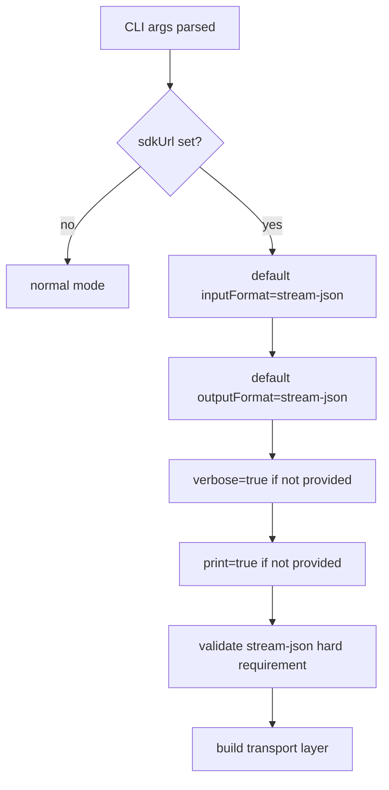
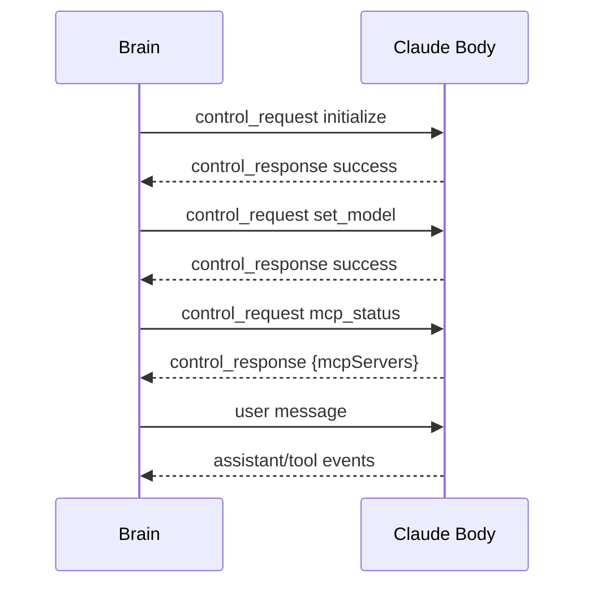
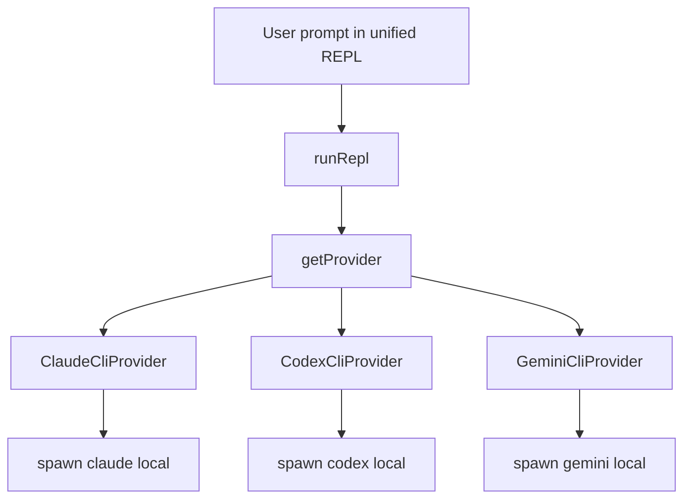
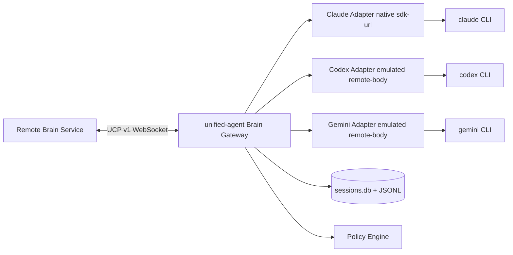
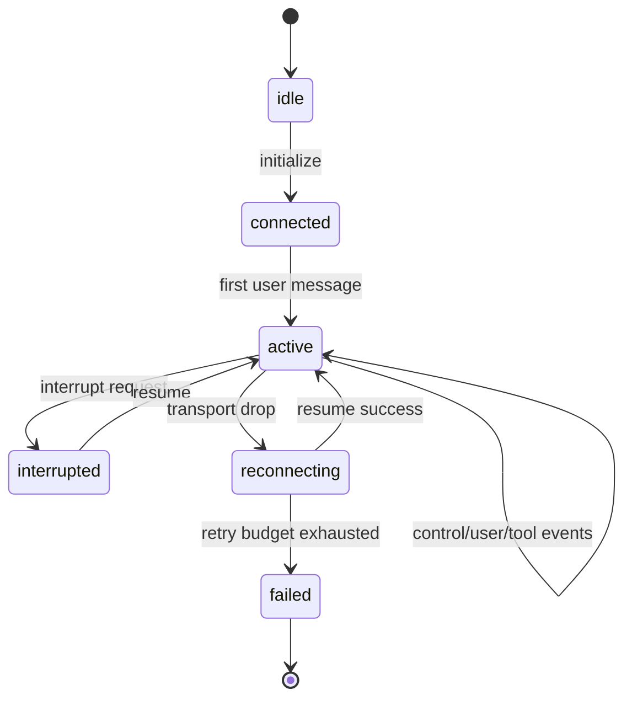
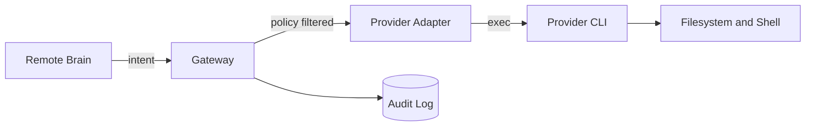
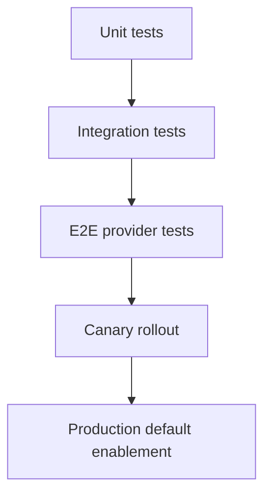
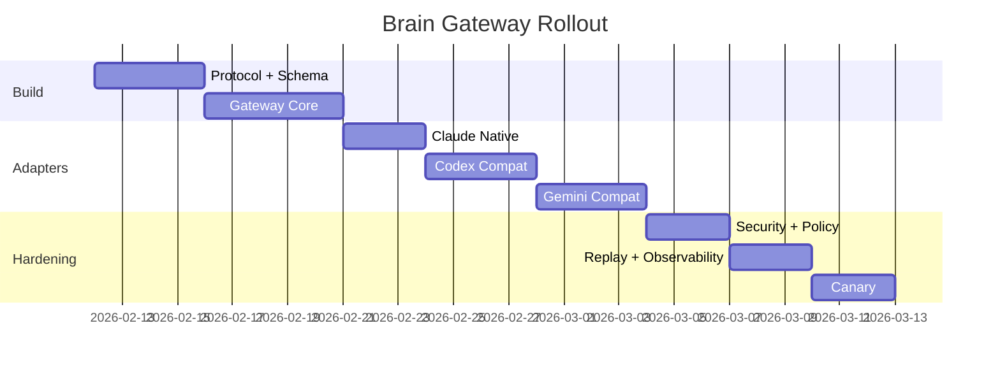
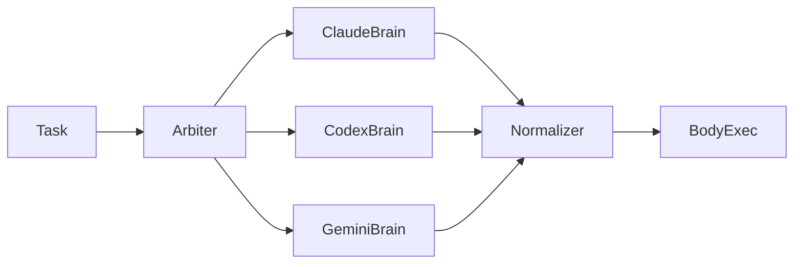

# PRD: Multi-Model Remote Brain Architecture for unified-agent

**Date:** 2026-02-11  
**Status:** Draft for review  
**Owner:** unified-agent  
**Scope:** Add `--sdk-url`-class remote cognition to `unified-agent` so one orchestration plane can drive Claude, Codex, and Gemini bodies with consistent policy, telemetry, and replay.

## 0. Direct Answer to the Core Question

Yes, you can reach the same high-level outcome across all models, but not by reusing Claude's `--sdk-url` protocol unchanged.

1. Native `--sdk-url` is a real Claude CLI capability and is implemented in `cli.js`.
2. Codex and Gemini in the current `unified-agent` integration are invoked through local CLI wrappers (`codex exec --json`, `gemini -p --output-format stream-json`) and do not expose the same remote control transport semantics in this codebase.
3. The correct strategy is to build a **universal control plane** in `unified-agent` with provider-specific adapters:
   - Claude adapter: pass-through to native `--sdk-url`.
   - Codex adapter: emulate remote-body behavior over local process control and JSON event translation.
   - Gemini adapter: same emulation approach with Gemini stream mapping and fallback model handling.

The result is "go to all models with one brain," while remaining explicit that only Claude has first-class native remote-body wiring in the analyzed artifact.

## 1. Evidence Baseline (File-Grounded)

All key claims below are grounded in files inspected in this session.

| ID | Verified Claim | Evidence |
|---|---|---|
| E-01 | Hidden CLI flag exists: `--sdk-url <url>` | `/Volumes/VRAM/00-09_System/01_Tools/Agent_Tools/claude-code/cli.js:7617` |
| E-02 | `sdkUrl` activates auto-coercion: defaults input/output to `stream-json`, forces verbose and print when missing | `/Volumes/VRAM/00-09_System/01_Tools/Agent_Tools/claude-code/cli.js:7578` |
| E-03 | `--sdk-url` hard-validates both stream formats | `/Volumes/VRAM/00-09_System/01_Tools/Agent_Tools/claude-code/cli.js:7597` |
| E-04 | Print-mode input validation is relaxed when `sdkUrl` is present | `/Volumes/VRAM/00-09_System/01_Tools/Agent_Tools/claude-code/cli.js:7436` |
| E-05 | Permission prompt tool source is forced to `stdio` when `sdkUrl` is set | `/Volumes/VRAM/00-09_System/01_Tools/Agent_Tools/claude-code/cli.js:7438` |
| E-06 | Transport selection switches to `SFA` when `sdkUrl` exists, else `ud1` | `/Volumes/VRAM/00-09_System/01_Tools/Agent_Tools/claude-code/cli.js:7450` |
| E-07 | Remote transport class `SFA` extends `ud1` and wires websocket/hybrid transport | `/Volumes/VRAM/00-09_System/01_Tools/Agent_Tools/claude-code/cli.js:7427` |
| E-08 | Parser `ud1` accepts `user`, `control_request`, `control_response`, plus keep-alive/env updates | `/Volumes/VRAM/00-09_System/01_Tools/Agent_Tools/claude-code/cli.js:7422` and `/Volumes/VRAM/00-09_System/01_Tools/Agent_Tools/claude-code/cli.js:7423` |
| E-09 | Control subtypes include `initialize`, `set_permission_mode`, `set_model`, `set_max_thinking_tokens`, `mcp_*` actions | `/Volumes/VRAM/00-09_System/01_Tools/Agent_Tools/claude-code/cli.js:7446` |
| E-10 | Hybrid ingress feature gate exists and uses POST endpoint derived from `/ws/` to `/session/.../events` | `/Volumes/VRAM/00-09_System/01_Tools/Agent_Tools/claude-code/cli.js:7427` |
| E-11 | Reconnect/heartbeat constants are embedded (`zJz=1000,aNq=3,wJz=1000,HJz=30000,OJz=1e4`) | `/Volumes/VRAM/00-09_System/01_Tools/Agent_Tools/claude-code/cli.js:7427` |
| E-12 | `unified-agent` currently has no `sdk-url` CLI argument | `/Volumes/VRAM/00-09_System/01_Tools/pai-unified-terminal/src/cli.ts:18` |
| E-13 | Current provider interface only supports `cwd` and optional `model` | `/Volumes/VRAM/00-09_System/01_Tools/pai-unified-terminal/src/providers/types.ts:10` |
| E-14 | Claude provider currently launches local `claude` CLI with stream-json and dangerous skip permissions | `/Volumes/VRAM/00-09_System/01_Tools/pai-unified-terminal/src/providers/claudeCli.ts:108` |
| E-15 | Codex provider currently launches local `codex exec --json` with bypass approvals | `/Volumes/VRAM/00-09_System/01_Tools/pai-unified-terminal/src/providers/codexCli.ts:102` |
| E-16 | Gemini provider currently launches local `gemini -p --output-format stream-json --yolo` | `/Volumes/VRAM/00-09_System/01_Tools/pai-unified-terminal/src/providers/geminiCli.ts:43` |
| E-17 | Session persistence currently tracks provider/model but no remote brain transport metadata | `/Volumes/VRAM/00-09_System/01_Tools/pai-unified-terminal/src/session/types.ts:29` and `/Volumes/VRAM/00-09_System/01_Tools/pai-unified-terminal/src/storage/sqlite.ts:23` |

## 2. Why This Matters

Your goal is not "add one flag." Your goal is to separate cognition from execution so the same orchestration layer can:

1. Switch providers by policy.
2. Delegate execution to machine-local tool bodies.
3. Keep durable session semantics and replay.
4. Enforce one security model even when provider CLIs differ.

That is a control-plane design problem, not a command parsing task.

## 3. Ground Truth: How `--sdk-url` Works in Claude CLI

## 3.1 Startup Coercion and Constraints

When `sdkUrl` exists, Claude forces headless stream semantics.



Operational implication: any orchestration gateway must speak strict line-delimited structured messages, not ad hoc text prompts.

## 3.2 Transport Split

`sdkUrl` flips stream transport from local process feed (`ud1`) to remote attach (`SFA`), then `SFA` chooses websocket transport (`Bd1`) or hybrid POST ingress (`CFA`) depending on environment gate.

```mermaid
flowchart LR
    Q[sdkUrl present] --> SFA[SFA extends ud1]
    SFA --> TNQ[tNq(url, headers, sessionId)]
    TNQ -->|default| WS[Bd1 websocket transport]
    TNQ -->|CLAUDE_CODE_POST_FOR_SESSION_INGRESS_V2=1| HY[CFA hybrid transport]
    HY --> POST[/session/.../events]
```

## 3.3 Control Surface

Observed control subtypes in handler chain include:

1. `initialize`
2. `set_permission_mode`
3. `set_model`
4. `set_max_thinking_tokens`
5. `mcp_status`
6. `mcp_message`
7. `mcp_set_servers`
8. `mcp_reconnect`
9. `mcp_toggle`
10. `rewind_files`

This means remote control is richer than "submit prompt." It can mutate runtime policy and model selection in-flight.



## 3.4 Permission Path Detail

In SDK mode, permission prompt source is set to `stdio` instead of named prompt tool wiring. This matters because your universal gateway must define an equivalent approval path for non-Claude adapters.

## 3.5 Reliability Characteristics

Embedded constants indicate reconnect and heartbeat logic:

1. replay/message buffer size anchor (`zJz=1000`)
2. reconnect attempts (`aNq=3`)
3. reconnect delay base (`wJz=1000`)
4. reconnect max (`HJz=30000`)
5. ping interval (`OJz=1e4`)

These should become explicit configurable knobs in your gateway, not hidden literals.

## 4. Current `unified-agent` Gap Analysis



Gaps vs target:

1. No remote brain URL concept in CLI args.
2. Provider API has no transport contract object.
3. No canonical control-request envelope.
4. No cross-provider permission governance layer.
5. Session schema cannot represent remote transport state.
6. No replay of control plane events, only user/assistant text.

## 5. Target Architecture: Universal Brain, Pluggable Bodies

## 5.1 Core Design

Build a local component called `Brain Gateway` inside `unified-agent`:

1. Accepts one canonical control protocol over websocket.
2. Maps control protocol to provider adapters.
3. Supports native pass-through for Claude `--sdk-url`.
4. Emulates remote-body behavior for Codex and Gemini.
5. Persists all canonical events for replay and audits.



## 5.2 Canonical Protocol Proposal (UCP v1)

```typescript
export type UcpEnvelope =
  | UcpControlRequest
  | UcpControlResponse
  | UcpUserMessage
  | UcpAssistantEvent
  | UcpKeepAlive
  | UcpError;

export interface UcpControlRequest {
  type: "control_request";
  request_id: string;
  request:
    | { subtype: "initialize"; provider: "claude" | "codex" | "gemini"; model?: string }
    | { subtype: "set_model"; model: string | "default" }
    | { subtype: "set_permission_mode"; mode: "default" | "acceptEdits" | "plan" | "bypassPermissions" }
    | { subtype: "set_max_thinking_tokens"; max_thinking_tokens: number | null }
    | { subtype: "mcp_status" }
    | { subtype: "interrupt" };
}

export interface UcpControlResponse {
  type: "control_response";
  response:
    | { subtype: "success"; request_id: string; response?: unknown }
    | { subtype: "error"; request_id: string; error: string };
}

export interface UcpUserMessage {
  type: "user";
  session_id: string;
  message: { role: "user"; content: string };
}
```

## 5.3 Provider Adapter Semantics

| Capability | Claude Adapter | Codex Adapter | Gemini Adapter |
|---|---|---|---|
| Native remote transport | Yes via `--sdk-url` | No in current integration | No in current integration |
| Model switch in-flight | Use control subtype mapping | Restart child with new `--model` | Restart child with new `--model` |
| Permission mode semantics | Native-like mapping | Gateway-enforced policy | Gateway-enforced policy |
| Tool telemetry shape | Claude stream-json events | Parse codex JSON events | Parse gemini stream events |
| MCP status fidelity | High | Medium (emulated from observed events) | Medium (emulated from observed events) |

## 5.4 Session and Replay Model



## 6. Functional Requirements

### 6.1 User-facing

1. Add `--brain-url <ws(s)://...>` to unified CLI.
2. Add `--brain-provider <claude|codex|gemini>` for initial adapter selection.
3. Add `--brain-session-id <id>` for resume/fork patterns.
4. Add `:brain connect <url>`, `:brain disconnect`, `:brain status`.
5. Add `:model <name|default>` behavior parity in remote mode.
6. Preserve current local delegated mode when no brain URL is supplied.

### 6.2 Control-plane

1. Support `initialize`, `set_model`, `set_permission_mode`, `set_max_thinking_tokens`, `interrupt`.
2. Return deterministic `control_response` for every `control_request`.
3. Emit normalized assistant/tool lifecycle events across providers.
4. Emit explicit compatibility warnings when a provider cannot honor a control subtype.

### 6.3 Persistence

1. Persist each control request/response in SQLite and JSONL.
2. Persist transport metadata per session.
3. Persist adapter-level errors with stable error codes.
4. Preserve existing session list/new/resume behavior.

### 6.4 Policy

1. Centralize permission mode policy in gateway.
2. Default to deny for unsupported or ambiguous control requests.
3. Add allowlist for dangerous provider flags in one file.

## 7. Non-Functional Requirements

1. P95 control-response latency below 200ms excluding model runtime.
2. Deterministic replay for control and user events.
3. Graceful reconnect with bounded retries and backoff.
4. No credentials persisted in event logs.
5. Structured logs for every adapter transition.
6. Compatibility mode should not regress current one-shot local usage.

## 8. Security and Trust Model



Hard controls:

1. Require explicit `--brain-url` allowlist regex in config.
2. Pin `wss://` by default; reject `ws://` unless `UNIFIED_AGENT_ALLOW_INSECURE_BRAIN=1`.
3. Redact secrets before persistence using existing redaction utilities.
4. Add max payload size for incoming envelopes.
5. Add per-session command rate limits.

## 9. Implementation Plan (Milestones)

## Milestone 0: Protocol and schema foundation

Exit criteria: canonical envelope types compiled and tested.

## Milestone 1: CLI and session plumbing

Exit criteria: CLI accepts remote options and persists metadata.

## Milestone 2: Gateway core

Exit criteria: websocket server handles initialize/user/control and writes canonical events.

## Milestone 3: Claude native adapter

Exit criteria: pass-through `--sdk-url` path works with normalized events.

## Milestone 4: Codex emulated adapter

Exit criteria: codex can run under gateway control envelope with parity on model switch and interrupts.

## Milestone 5: Gemini emulated adapter

Exit criteria: gemini can run under gateway control envelope with fallback model strategy preserved.

## Milestone 6: Policy and security controls

Exit criteria: permission mode engine and endpoint controls enabled by default.

## Milestone 7: Replay, observability, and runbooks

Exit criteria: deterministic replay and metrics dashboards available.

## Milestone 8: Rollout and hardening

Exit criteria: canary rollout passed, fallback strategy validated.

## 10. Atomic Engineering Checklist

Each line is intentionally atomic. No grouped implementation items.

- [ ] Add `brainUrl?: string` to CLI args type in `src/cli.ts`.
- [ ] Add `brainProvider?: "claude" | "codex" | "gemini"` to CLI args type in `src/cli.ts`.
- [ ] Add `brainSessionId?: string` to CLI args type in `src/cli.ts`.
- [ ] Parse `--brain-url` in `parseArgs` in `src/cli.ts`.
- [ ] Parse `--brain-provider` in `parseArgs` in `src/cli.ts`.
- [ ] Parse `--brain-session-id` in `parseArgs` in `src/cli.ts`.
- [ ] Add usage text line for `--brain-url` in `printUsage`.
- [ ] Add usage text line for `--brain-provider` in `printUsage`.
- [ ] Add usage text line for `--brain-session-id` in `printUsage`.
- [ ] Add validation that `--brain-url` is URL-parseable.
- [ ] Add validation that `--brain-provider` is one of supported enum values.
- [ ] Thread `brainUrl` through `runRepl` options.
- [ ] Thread `brainProvider` through `runRepl` options.
- [ ] Thread `brainSessionId` through `runRepl` options.
- [ ] Add `remoteControlMode` field to run options in `src/repl.ts`.
- [ ] Add `:brain connect <url>` command in `src/commands/parse.ts`.
- [ ] Add `:brain disconnect` command in `src/commands/parse.ts`.
- [ ] Add `:brain status` command in `src/commands/parse.ts`.
- [ ] Add command union types for brain commands in `src/commands/parse.ts`.
- [ ] Add command handler branch for brain connect in `src/repl.ts`.
- [ ] Add command handler branch for brain disconnect in `src/repl.ts`.
- [ ] Add command handler branch for brain status in `src/repl.ts`.
- [ ] Add `gatewaySessionId?: string` to `MetaSession` in `src/session/types.ts`.
- [ ] Add `brainUrl?: string` to `MetaSession` in `src/session/types.ts`.
- [ ] Add `brainProvider?: ProviderName` to `MetaSession` in `src/session/types.ts`.
- [ ] Add canonical event types for control requests in `src/session/types.ts`.
- [ ] Add canonical event types for control responses in `src/session/types.ts`.
- [ ] Add canonical event type for transport_state in `src/session/types.ts`.
- [ ] Add SQLite migration for `brain_url` column.
- [ ] Add SQLite migration for `brain_provider` column.
- [ ] Add SQLite migration for `gateway_session_id` column.
- [ ] Update `createMetaSession` insert columns for new metadata.
- [ ] Update `getMetaSession` projection to include new metadata.
- [ ] Update `listMetaSessions` projection to include new metadata.
- [ ] Add event insert helper for non-text structured events.
- [ ] Keep backward compatibility for old rows with null remote fields.
- [ ] Add `src/gateway/protocol.ts` for canonical envelope types.
- [ ] Add `src/gateway/errors.ts` for stable gateway error codes.
- [ ] Add `src/gateway/wsServer.ts` for websocket listener.
- [ ] Add `src/gateway/sessionRegistry.ts` for connection/session mapping.
- [ ] Add `src/gateway/router.ts` for request dispatch by subtype.
- [ ] Add `src/gateway/replayBuffer.ts` for bounded message replay.
- [ ] Add `src/gateway/heartbeat.ts` for keepalive and timeout handling.
- [ ] Add `src/gateway/policy.ts` for permission mode checks.
- [ ] Add `src/gateway/compat.ts` for unsupported subtype responses.
- [ ] Add `src/adapters/base.ts` with shared adapter interface.
- [ ] Add `src/adapters/claudeNative.ts` for native `--sdk-url` strategy.
- [ ] Add `src/adapters/codexCompat.ts` for emulated remote-body codex strategy.
- [ ] Add `src/adapters/geminiCompat.ts` for emulated remote-body gemini strategy.
- [ ] Add adapter factory keyed by provider.
- [ ] Extend provider ask options to include remote transport hints.
- [ ] Add interrupt support contract in provider interface.
- [ ] Add set-model support contract in provider interface.
- [ ] Add permission mode support contract in provider interface.
- [ ] Add runtime capability introspection API per adapter.
- [ ] Add `control_request initialize` handler in gateway router.
- [ ] Add `control_request set_model` handler in gateway router.
- [ ] Add `control_request set_permission_mode` handler in gateway router.
- [ ] Add `control_request set_max_thinking_tokens` handler in gateway router.
- [ ] Add `control_request interrupt` handler in gateway router.
- [ ] Add `control_request mcp_status` compatibility handler.
- [ ] Add default error response for unknown subtype.
- [ ] Add deterministic request-id correlation store.
- [ ] Add timeout handling per request subtype.
- [ ] Add unified event normalizer for Claude event shapes.
- [ ] Add unified event normalizer for Codex event shapes.
- [ ] Add unified event normalizer for Gemini event shapes.
- [ ] Add conformance tests for each normalizer.
- [ ] Add explicit mapping table in code comments for adapter differences.
- [ ] Add secure URL policy: reject non-wss unless explicit override.
- [ ] Add URL allowlist config key in local config file.
- [ ] Add max frame size guard for incoming websocket messages.
- [ ] Add max pending request guard per session.
- [ ] Add rate limit guard for control requests.
- [ ] Add redact-before-persist hook for all incoming/outgoing payloads.
- [ ] Add opt-in raw payload debug mode with heavy warning.
- [ ] Add telemetry counters: requests_total by subtype/provider.
- [ ] Add telemetry histogram: control_response_latency_ms.
- [ ] Add telemetry counter: reconnect_attempts_total.
- [ ] Add telemetry counter: policy_denials_total.
- [ ] Add telemetry counter: unsupported_subtype_total.
- [ ] Add log line schema docs in `implementation` for operations.
- [ ] Add replay command `:brain replay <sessionId>` for debug.
- [ ] Add deterministic replay runner reading canonical JSONL.
- [ ] Add replay verification report output.
- [ ] Add gateway smoke script in `scripts/`.
- [ ] Add adapter smoke script for Claude native route.
- [ ] Add adapter smoke script for Codex compatibility route.
- [ ] Add adapter smoke script for Gemini compatibility route.
- [ ] Add unit tests for CLI arg parsing of brain flags.
- [ ] Add unit tests for command parser brain commands.
- [ ] Add unit tests for protocol validator.
- [ ] Add unit tests for policy engine.
- [ ] Add unit tests for sqlite migrations.
- [ ] Add unit tests for canonical event persistence.
- [ ] Add integration tests for initialize -> user -> response lifecycle.
- [ ] Add integration tests for set_model behavior per provider.
- [ ] Add integration tests for interrupt behavior per provider.
- [ ] Add integration tests for reconnect and replay.
- [ ] Add integration tests for unsupported subtype fallback behavior.
- [ ] Add end-to-end test: one remote brain drives Claude body.
- [ ] Add end-to-end test: one remote brain drives Codex body.
- [ ] Add end-to-end test: one remote brain drives Gemini body.
- [ ] Add end-to-end test: provider switch mid-session.
- [ ] Add end-to-end test: permission mode changed mid-session.
- [ ] Add documentation section in README for remote brain mode.
- [ ] Add troubleshooting section for brain connection failures.
- [ ] Add troubleshooting section for provider incompatibility warnings.
- [ ] Add troubleshooting section for replay divergence.
- [ ] Add rollback switch to disable brain mode at startup.
- [ ] Add canary rollout toggle in config/env.
- [ ] Add fallback path that returns to current local delegated mode.
- [ ] Add migration script for existing sessions to include remote metadata defaults.
- [ ] Add changelog entry describing protocol and migration impacts.

## 11. Verification Plan



Acceptance gates:

1. Unit coverage added for new parser/protocol/policy code paths.
2. Integration suite passes for all control subtypes implemented.
3. E2E validates at least one successful task run on each provider.
4. Reconnect + replay tests pass with deterministic request correlation.
5. No secret leakage detected in stored events during redaction tests.

## 12. Rollout Strategy

1. Phase A: dark launch behind `UNIFIED_AGENT_ENABLE_BRAIN_GATEWAY=1`.
2. Phase B: Claude adapter only, codex/gemini disabled with explicit message.
3. Phase C: Codex compatibility adapter enabled for internal users.
4. Phase D: Gemini compatibility adapter enabled for internal users.
5. Phase E: default-on for brain mode when `--brain-url` provided.



## 13. Alien Opportunities (High-Leverage, Realistic)

These are the "go much harder" opportunities unlocked when cognition is detached from execution and normalized across models.

## 13.1 Polybrain Arbitration with One Body

Use Claude + Codex + Gemini as parallel planners, then commit one normalized plan to one body. You can optimize for cost, speed, and risk simultaneously.



## 13.2 Dynamic Body Placement

Same brain session can select body placement by task type:

1. local macOS body for file-heavy refactors,
2. containerized linux body for reproducible CI repair,
3. isolated high-trust body for risky shell operations.

## 13.3 Cognitive Firewalls

Insert a policy brain between planner and body so dangerous actions require multi-signal approval (static policy + model vote + operator override).

## 13.4 Self-Evolution Loops (Truthful Boundaries)

Can the AI "build itself on demand"?  
Answer: **partially, under explicit constraints**.

What is true:

1. It can generate and apply code that changes orchestration logic.
2. It can run iterative test-fix loops over its own gateway/adapters.
3. It can stage upgrade plans and migrate schemas.

What is not true (without extra systems):

1. Fully autonomous safe self-rewrite in production with no guardrails.
2. Guaranteed alignment of self-modifications across all providers.
3. Unlimited recursive self-improvement without cost/risk explosion.

Required controls for safe self-evolution:

1. branch-isolated code changes,
2. deterministic test gates,
3. human checkpoint before deploy,
4. signed release policy.

## 14. Known Uncertainties and Research Corrections

During review of `/Volumes/VRAM/80-89_Resources/80_Reference/research/ClaudeCode/`, several documents are directionally useful but need strict revalidation before implementation assumptions are promoted to hard requirements.

1. Some protocol examples in research docs use message shapes like `tool_call`/`partial_message` that do not match `ud1` parser expectations observed in `cli.js`.
2. Environment-variable claims (example: `CLAUDE_CODE_SDK_URL`) should not replace CLI-flag evidence unless corroborated by runtime code paths.
3. Hybrid ingress specifics should be treated as implementation detail until integration tests confirm exact endpoint behavior in your runtime environment.

This PRD therefore uses `cli.js` behavioral evidence as source of truth and treats speculative research content as hypotheses.

## 15. Requested Feedback Before Build

Please confirm these decision points before coding:

1. Should remote mode be enabled by `--brain-url` only, or also via config default?
2. Should codex/gemini adapters emulate full control subtypes or only `initialize`, `set_model`, and `interrupt` in v1?
3. Should we allow insecure `ws://` for local development by default, or require explicit override?
4. Should policy default be strict-deny for unknown control subtypes across all providers?
5. Do you want phase-1 implementation to ship Claude-first, or deliver all three adapters behind feature flags in one release?
