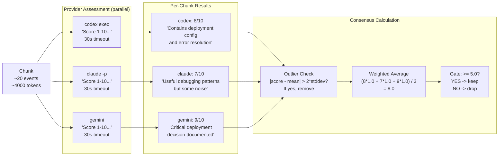
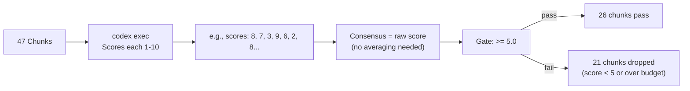
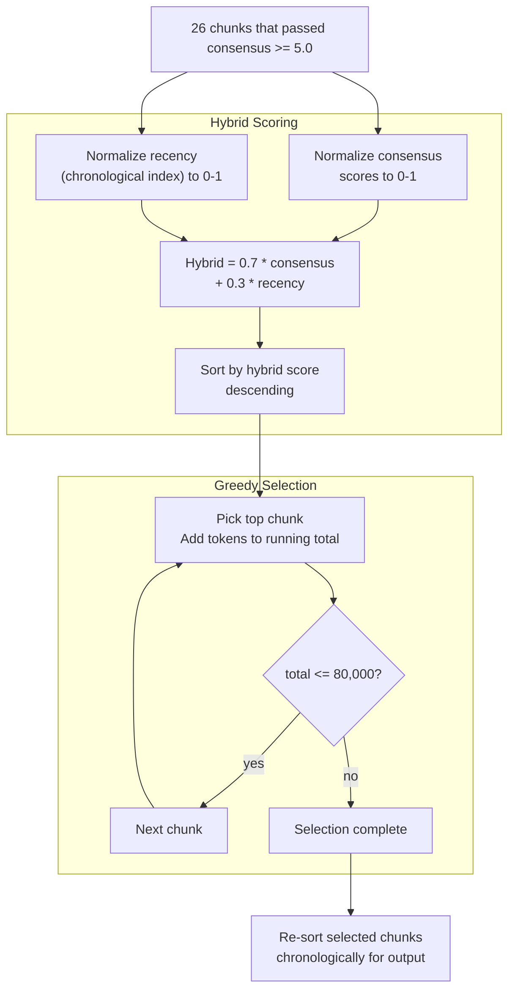
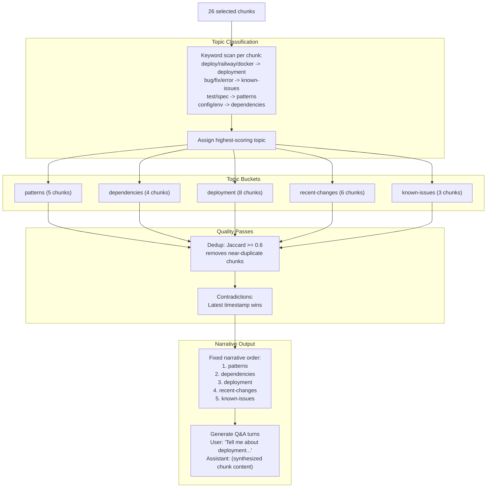
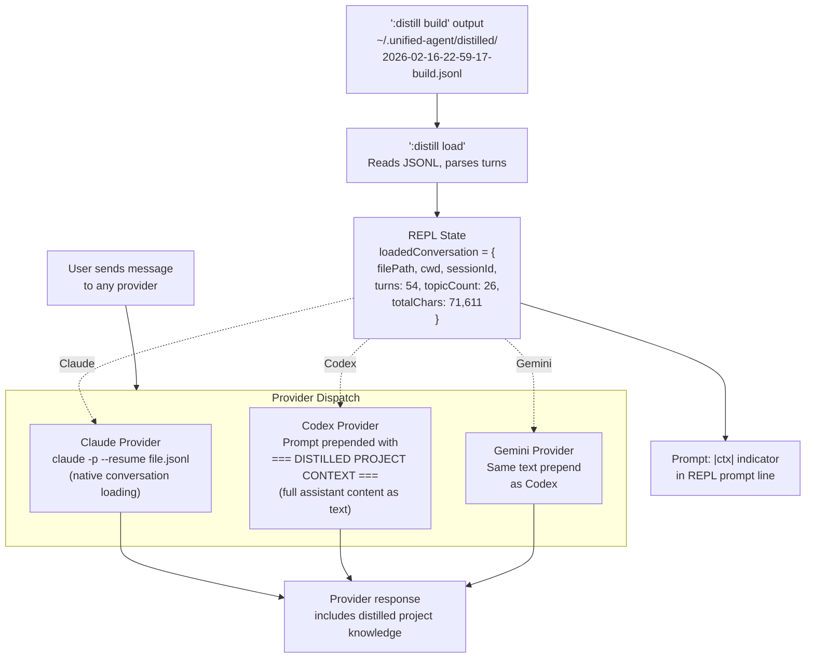

# Distill Pipeline Architecture

## Full Pipeline Overview

```mermaid
flowchart TB
    subgraph INPUT["1. Input"]
        NL["':distill filter' or ':distill build'"]
        SESSIONS["Session Files<br/>~/.claude/projects/**/*.jsonl<br/>~/.codex/**/*.jsonl<br/>~/.gemini/**/*.json"]
    end

    subgraph SCAN["2. Scan & Parse"]
        SCANNER["Scanner<br/>projectPath filter<br/>since/until dates<br/>limit N sessions"]
        PARSER["Parser<br/>detectParser() per file<br/>Claude / Codex / Gemini format"]
        EVENTS["ParsedEvent[]<br/>role, content, toolName,<br/>toolInput, toolOutput, timestamp"]
    end

    subgraph SCORE["3. Score & Chunk"]
        IMPORTANCE["Importance Scorer<br/>Base: 50<br/>+15 tool use<br/>+20 error<br/>+12 file edit<br/>+10 user prompt<br/>-20 system event"]
        FILTER_LOW["Filter: score >= 30"]
        CHUNKER["Chunker<br/>Window: 20 events max<br/>Budget: 4000 tokens/chunk<br/>Overlap: 2 events"]
        KW_FILTER["Keyword Filter<br/>(if NL keywords extracted)"]
    end

    subgraph ASSESS["4. Multi-Agent Assessment"]
        SPAWN["Spawn Provider CLIs<br/>codex exec / claude -p / gemini"]
        SCORE_110["Each provider scores 1-10<br/>+ rationale text<br/>30s timeout, 1 retry"]
        CONSENSUS["Consensus<br/>Weighted avg<br/>Outlier removal (2 stddev)<br/>minAssessments check"]
    end

    subgraph DISTILL["5. Distill & Select"]
        FILTER_CONS["Filter: consensus >= 5.0"]
        SORT["Hybrid Sort<br/>70% consensus + 30% recency"]
        BUDGET["Greedy Token Budget<br/>Pick top chunks until 80K tokens"]
        REORDER["Re-sort chronologically<br/>for narrative coherence"]
    end

    subgraph SYNTHESIZE["6. Synthesize & Generate"]
        CLASSIFY["Topic Classifier<br/>9 topics via keyword matching"]
        DEDUP["Deduplication<br/>Jaccard >= 0.6 removes duplicates"]
        CONTRADICT["Contradiction Resolution<br/>Latest timestamp wins"]
        NARRATIVE["Narrative Assembly<br/>overview -> architecture -> patterns<br/>-> dependencies -> deployment<br/>-> decisions -> recent-changes -> known-issues"]
        JSONL["JSONL Generator<br/>Claude Code format<br/>uuid chain, timestamps,<br/>user/assistant turns"]
    end

    subgraph LOAD["7. Load & Use"]
        LOAD_CMD["':distill load'"]
        STATE["REPL State<br/>loadedConversation"]
        CLAUDE_RESUME["Claude: --resume flag<br/>(native conversation history)"]
        OTHER_CTX["Codex/Gemini: text prepend<br/>(DISTILLED PROJECT CONTEXT block)"]
    end

    NL --> SCANNER
    SESSIONS --> SCANNER
    SCANNER --> PARSER
    PARSER --> EVENTS
    EVENTS --> IMPORTANCE
    IMPORTANCE --> FILTER_LOW
    FILTER_LOW --> CHUNKER
    CHUNKER --> KW_FILTER
    KW_FILTER --> SPAWN
    SPAWN --> SCORE_110
    SCORE_110 --> CONSENSUS
    CONSENSUS --> FILTER_CONS
    FILTER_CONS --> SORT
    SORT --> BUDGET
    BUDGET --> REORDER
    REORDER --> CLASSIFY
    CLASSIFY --> DEDUP
    DEDUP --> CONTRADICT
    CONTRADICT --> NARRATIVE
    NARRATIVE --> JSONL
    JSONL --> LOAD_CMD
    LOAD_CMD --> STATE
    STATE --> CLAUDE_RESUME
    STATE --> OTHER_CTX
```



## Assessment Deep Dive

This is the quality gate. Each chunk is independently evaluated by one or more AI providers.



### Single Provider Mode (--providers codex)

When only one provider is specified, `minAssessments` is set to 1 (not the default 2), so chunks aren't dropped for having too few assessments:



## Token Budget Selection



## Topic Synthesis Flow



## Context Loading & Injection



## Quality Gates Summary

| Gate | Stage | Threshold | Effect |
|------|-------|-----------|--------|
| Importance | Scoring | >= 30 | Drops system events, hooks, low-value content |
| Token budget | Chunking | <= 4000/chunk | Prevents oversized chunks |
| Keyword filter | Post-chunk | Contains keyword | Focuses on user-specified topics |
| Assessment | Multi-agent | 1-10 score per provider | Independent quality evaluation |
| Consensus | Aggregation | >= 5.0 weighted avg | Drops low-quality chunks |
| Outlier removal | Consensus | > 2 stddev | Removes rogue assessments |
| Token budget | Selection | <= 80,000 total | Fits within context window |
| Deduplication | Synthesis | Jaccard >= 0.6 | Removes near-duplicate content |
| Contradiction | Synthesis | Latest wins | Ensures current information |

## Numbers from Your Run

```
Input:  20 sessions, 2466 events
Scored: Events with importance >= 30 kept
Chunks: 143 built -> 47 after keyword "railway" filter
Assessed: 47 chunks by codex (single provider)
Consensus: minAssessments=1 (single provider mode)
Selected: 26 of 47 (consensus >= 5.0, within 78,708 token budget)
Dropped: 21 chunks (below threshold or over budget)
Topics: 5 (patterns, dependencies, deployment, recent-changes, known-issues)
Output: 54 turns, 71,611 chars of distilled context
```
